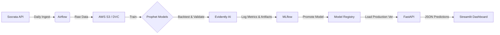

# 🚔 Chicago Crime Radar: End-to-End MLOps Platform


## 📋 Project Overview

**Chicago Crime Radar** is a production-grade MLOps platform designed to forecast crime volume across Chicago's 77 community areas. Unlike static analysis projects, this is a **living system** that ingests live government data daily, retrains models, validates performance against historical drift, and deploys forecasts via a REST API.

**Business Value:** enables police districts and community organizers to anticipate resource needs up to 7 days in advance, accounting for the inherent reporting lag in public data.

---

## 🏗️ System Architecture

The project follows a **Microservices Architecture** hosted on AWS EC2 (or local Docker), fully containerized.



### Key Components
1.  **Data Factory (Airflow):** Orchestrates daily ETL jobs. Fetches data from the City of Chicago Socrata API, handles API rate limits, and versions datasets using **DVC** (Data Version Control) backed by **AWS S3**.
2.  **Training Engine (Prophet):** Trains **77 distinct time-series models** (one per neighborhood). Uses **3-Fold Rolling Window Backtesting** to evaluate stability over the last 90 days.
3.  **Observability (MLflow & Evidently AI):**
    *   Tracks RMSE, MAE, and R2 scores for every run.
    *   Generates **Evidently AI** regression reports (HTML) to visualize error distribution and drift.
    *   Logs granular per-area error metrics to identify "hotspots" where the model is underperforming.
4.  **Inference (FastAPI):** A decoupled REST API that loads the latest "Production" model from the registry. Supports dynamic reloading (`/refresh`) without downtime.
5.  **Presentation (Streamlit):** Interactive dashboard featuring Mapbox heatmaps and deep-dive trend analysis graphs.

---

## 🚀 Key Engineering Features

### 1. Handling the "Blind Spot" (Data Lag)
Public crime data has a reporting lag of ~7 days. A standard regression model relying on "Yesterday's Crime Count" would fail in production.
*   **Solution:** Implemented **Facebook Prophet** for pure time-series forecasting. The model predicts the "Blind Spot" (Gap Fill) and the "Future" simultaneously based on seasonal trends, holiday effects, and historical patterns.

### 2. Surgical Hyperparameter Tuning
Crime distribution in Chicago is heterogeneous (High volume in Austin vs. Low volume in Edison Park).
*   **Solution:** Implemented **Volume-Based Dynamic Tuning**.
    *   *High-Variance Zones:* Higher `changepoint_prior_scale` (0.2) to capture rapid spikes.
    *   *Low-Variance Zones:* Stiff regularization (0.01) to prevent overfitting to noise.

### 3. Automated Quality Gates
*   **Solution:** The Airflow pipeline includes a **Backtesting Task**. It hides the last 28 days of data, forces the model to predict them, and calculates RMSE against ground truth. MLflow logs these metrics, and Evidently AI generates a visual report.

---

## 🛠️ Installation & Setup

### Prerequisites
*   Docker & Docker Compose
*   AWS Credentials (Access Key & Secret Key) with S3 read/write access.

### 1. Clone the Repository
```bash
git clone https://github.com/YOUR_USERNAME/chicago-crime-pipeline.git
cd chicago-crime-pipeline
```

### 2. Configure Environment
Create a `.env` file in the root directory:
```bash
AIRFLOW_UID=50000
AWS_ACCESS_KEY_ID=your_access_key
AWS_SECRET_ACCESS_KEY=your_secret_key
AWS_DEFAULT_REGION=us-east-1
```

### 3. Launch the Stack
```bash
docker-compose up -d --build
```
*This spins up Airflow (Webserver/Scheduler), Postgres, MLflow, FastAPI, and Streamlit.*

---

## 💻 Usage

### 1. The Dashboard (Streamlit)
*   **URL:** `http://localhost:8501`
*   View the city-wide heatmap for tomorrow.
*   Drill down into specific neighborhoods to see "Actual vs. Predicted" history.

### 2. The API (FastAPI)
*   **URL:** `http://localhost:8000/docs` (Swagger UI)
*   **Endpoints:**
    *   `POST /predict`: Get forecast for a specific Area and Date.
    *   `GET /stats`: Get metadata about the latest ingestion date.
    *   `POST /webhook/refresh`: Force model reload from MLflow.

### 3. Pipeline Monitoring (Airflow)
*   **URL:** `http://localhost:8080`
*   **Credentials:** `airflow` / `airflow`
*   Trigger the `chicago_crime_pipeline` DAG to manually start ingestion and training.

### 4. Experiment Tracking (MLflow)
*   **URL:** `http://localhost:5001`
*   View run history, compare RMSE across experiments, and download Evidently AI HTML reports.

---

## 📊 Performance & Metrics

We evaluate the model using **RMSE** and **MAE**.

*   **Scale Dependency:** We observed that High-Crime areas (e.g., The Loop) have higher absolute RMSE but low percentage error (~12%). Low-Crime areas have low RMSE but high percentage error due to signal sparsity.
*   **Validation Strategy:** We use a **3-Fold Rolling Window Backtest** (3 splits of 28 days each) to ensure the model performs robustly across different months/seasons.

| Metric | Value (Approx) | Note |
| :--- | :--- | :--- |
| **Global MAE** | ~2.5 | On average, prediction is off by 2.5 crimes/day. |
| **Mean Error** | ~0.15 | The model is unbiased (sum of errors is near zero). |

---

## 📂 Project Structure

```text
├── api/
│   └── main.py              # FastAPI Microservice
├── dags/
│   └── crime_pipeline.py    # Airflow DAG definition
├── dashboard/
│   └── app.py               # Streamlit Frontend
├── data/
│   └── chicago_map.geojson  # Static geospatial data
├── scripts/
│   ├── ingest.py            # Socrata API ETL script
│   └── train.py             # Prophet Training & Backtesting logic
├── docker-compose.yaml      # Infrastructure definition
├── Dockerfile               # Custom Airflow image
├── Dockerfile.mlflow        # Custom MLflow image (with boto3)
└── requirements.txt         # Python dependencies
```

---

## 🔮 Future Improvements
*   **External Regressors:** Integrate OpenWeatherMap API to correlate crime drops with precipitation/temperature.
*   **Events Data:** Ingest "Chicago Events" data (Cubs games, Lollapalooza) as additional Prophet regressors.
*   **Alerting:** Connect Airflow to Slack/Email to alert when `RMSE > Threshold`.

---

## 📝 License
This project uses public data provided by the [City of Chicago Data Portal](https://data.cityofchicago.org/).